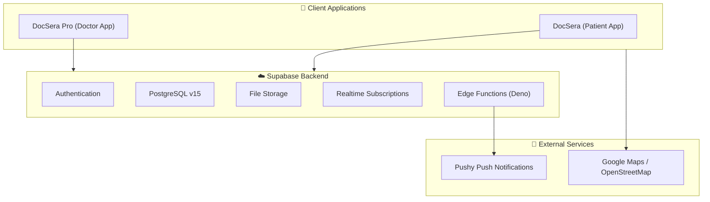
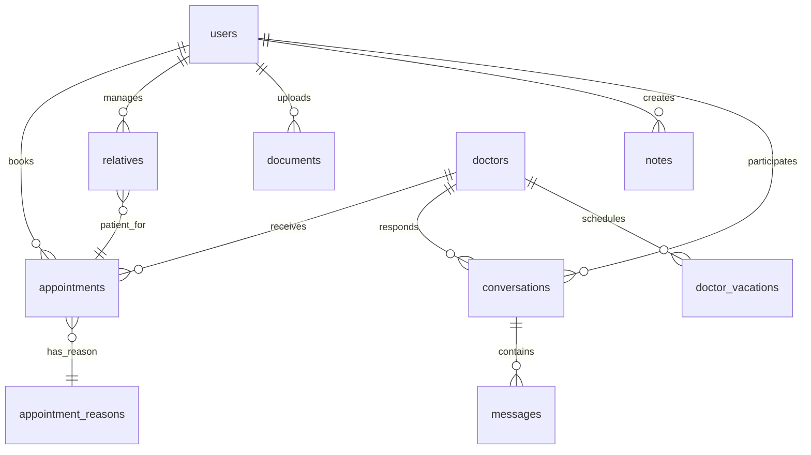

# DocSera Technology Stack Documentation

> **Version:** 1.0.0+13 | **Last Updated:** January 15, 2026  
> **Platform:** iOS, Android | **Shared Backend:** DocSera + DocSera Pro

---

## Architecture Overview



> [!NOTE]
> This documentation focuses on **DocSera (Patient App)**. The Supabase backend is shared with DocSera Pro (Doctor App).

---

## Frontend Stack

| Technology | Version | Purpose |
|------------|---------|---------|
| **Flutter** | SDK ≥3.6.0 <4.0.0 | Cross-platform UI framework |
| **Dart** | Latest stable | Programming language |
| **flutter_bloc** | ^9.1.0 | State management (Cubit pattern) |
| **flutter_screenutil** | ^5.9.3 | Responsive UI scaling |

### Typography

| Font | Language | Weights |
|------|----------|---------|
| **Montserrat** | English | 300, 400, 500, 600, 700 |
| **Cairo** | Arabic | 100, 300, 400, 500, 600, 700, 900 |

---

## Backend Infrastructure

| Technology | Details | Purpose |
|------------|---------|---------|
| **Supabase** | Cloud-hosted | Backend-as-a-Service |
| **PostgreSQL** | v15 | Primary database |
| **Supabase Auth** | Phone OTP + Email | User authentication |
| **Supabase Realtime** | Built-in | Live subscriptions |
| **Supabase Storage** | Buckets: `chat.attachments`, `doctor` | File storage |
| **Edge Functions** | Deno/TypeScript | Serverless functions |

---

## State Management (BLoC Pattern)

### DocSera Patient App Cubits

| Cubit | Responsibility |
|-------|---------------|
| `AuthCubit` | Authentication, login/logout |
| `MainScreenCubit` | Home screen data |
| `AppointmentsCubit` | Appointment management |
| `MessagesCubit` | Conversations & messaging |
| `DocumentsCubit` | Medical documents |
| `NotesCubit` | Patient notes |
| `UserCubit` | User profile & preferences |
| `PatientSwitcherCubit` | Multi-patient (relatives) switching |
| `RelativesCubit` | Family member management |
| `DoctorScheduleCubit` | Doctor availability |
| `PopupBannerCubit` | In-app announcements |
| `AccountProfileCubit` | Profile settings |
| `AccountSecurityCubit` | Security settings |
| `AccountDangerCubit` | Account deactivation |

---

## Database Schema

### Tables Used by DocSera Patient App

| Table | Purpose | RLS Status |
|-------|---------|------------|
| `users` | Patient profiles | ✅ Enabled |
| `doctors` | Doctor public profiles | ✅ Enabled |
| `appointments` | Appointment bookings | ✅ Enabled |
| `appointment_reasons` | Booking reasons | ✅ Enabled |
| `conversations` | Chat threads | ✅ Enabled |
| `messages` | Chat messages | ✅ Enabled |
| `message_reasons` | Conversation topics | ✅ Enabled |
| `documents` | Medical documents | ⚠️ Pending |
| `notes` | Patient notes | ⚠️ Pending |
| `relatives` | Family members | ✅ Enabled |
| `banners` | Home page banners | ✅ Enabled |
| `home_cards` | Home action cards | ⚠️ Pending |
| `popup_banners` | In-app popups | ⚠️ Pending |
| `user_devices` | Push notification tokens | ✅ Enabled |
| `doctor_vacations` | Doctor unavailability | ✅ Enabled |
| `points_history` | Loyalty points | ⚠️ Pending |
| `otp` | Phone OTP codes | ⚠️ Pending |

> [!IMPORTANT]
> Tables marked ⚠️ **Pending** will have RLS policies added before production release.

---

### Tables Used by DocSera Pro Only

| Table | Purpose | RLS Status |
|-------|---------|------------|
| `doctor_accounts` | Clinic accounts | ✅ Enabled |
| `doctor_members` | Team members | ✅ Enabled |
| `team_profiles` | Staff profiles | ✅ Enabled |
| `doctor_patients` | Manual patients | ✅ Enabled |
| `doctor_patient_links` | Patient relationships | ✅ Enabled |
| `doctor_account_patients` | Clinic patients | ✅ Enabled |
| `doctor_patient_blocks` | Blocked patients | ✅ Enabled |
| `accounting` | Financial records | ⚠️ Pending |
| `accounting_labels` | Expense categories | ✅ Enabled |
| `doctor_reports` | Generated reports | ✅ Enabled |
| `doctor_report_templates` | Report templates | ✅ Enabled (Forced) |
| `todo_tasks` | Doctor to-do list | ✅ Enabled |
| `reason_time_slots` | Custom availability | ⚠️ Pending |
| `medical_master` | Medical conditions catalog | ⚠️ Pending |
| `patient_medical_records` | Health records | ⚠️ Pending |

---

### Entity Relationships



---

## Database Views

| View | Purpose |
|------|---------|
| `v_my_membership` | Current user's doctor membership |
| `v_team_members` | Team members with profiles |
| `v_doctor_members_safe` | Safe member listing |
| `v_doctor_patients_full` | Unified patient view |
| `v_clinic_patients_searchable` | Searchable patient list |

---

## RPC Functions Used by DocSera

### Patient-Facing RPCs

| Function | Purpose | Security |
|----------|---------|----------|
| `book_appointment_by_patient` | Book new appointment | DEFINER |
| `cancel_appointment_by_patient` | Cancel appointment | DEFINER |
| `get_available_slots` | Get doctor availability | INVOKER |
| `add_appointment_attachment` | Add files to appointment | DEFINER |
| `remove_appointment_attachment` | Remove appointment files | DEFINER |
| `rpc_get_my_user` | Get current user profile | DEFINER |
| `rpc_update_my_user` | Update user profile | DEFINER |
| `rpc_get_my_relatives` | List family members | DEFINER |
| `rpc_add_my_relative` | Add family member | DEFINER |
| `rpc_update_my_relative` | Update family member | DEFINER |
| `rpc_delete_my_relative` | Remove family member | DEFINER |
| `rpc_get_my_favorite_doctors` | Get saved doctors | DEFINER |
| `rpc_toggle_favorite_doctor` | Save/unsave doctor | DEFINER |
| `rpc_get_my_security_state` | Get security settings | DEFINER |
| `rpc_get_my_patient_context` | Get patient booking info | DEFINER |
| `rpc_deactivate_my_account` | Deactivate account | DEFINER |
| `rpc_mark_messages_read` | Mark messages as read | DEFINER |
| `send_login_otp` | Request login OTP | DEFINER |
| `verify_login_otp` | Verify OTP code | DEFINER |

### Authentication RPCs

| Function | Purpose |
|----------|---------|
| `phone_exists` | Check phone registration |
| `email_exists` | Check email registration |
| `upsert_user_email` | Register email |
| `update_user_email` | Change email |

---

## Edge Functions

| Function | Purpose | JWT Required |
|----------|---------|--------------|
| `send_email_otp` | Send verification emails | Yes |
| `push_notifications` | Dispatch push via Pushy | Service Role |
| `update_email_admin` | Admin email updates | Service Role |

---

## Database Triggers

| Trigger | Table | Purpose |
|---------|-------|---------|
| `trg_sync_appointment_date_time` | appointments | Sync date/time from timestamp |
| `trg_handle_new_message` | messages | Update conversation metadata |
| `trg_award_points_after_done` | appointments | Award loyalty points |
| `trg_sync_doctor_account_patients` | appointments | Track patient relationships |
| `trg_create_default_message_reasons` | doctors | Initialize conversation topics |
| `trg_assign_invoice_number` | accounting | Auto-increment invoices |

---

## Active Package Dependencies

### Core & State Management
| Package | Version | Purpose |
|---------|---------|---------|
| `supabase_flutter` | ^2.9.1 | Supabase SDK |
| `flutter_bloc` | ^9.1.0 | BLoC pattern |
| `shared_preferences` | ^2.4.0 | Local key-value storage |

### Authentication & Security
| Package | Version | Purpose |
|---------|---------|---------|
| `local_auth` | ^2.3.0 | Biometric auth (Face ID, fingerprint) |
| `flutter_secure_storage` | ^9.2.4 | Encrypted storage |
| `crypto` | ^3.0.0 | Cryptographic operations |

### UI Components
| Package | Version | Purpose |
|---------|---------|---------|
| `flutter_screenutil` | ^5.9.3 | Responsive scaling |
| `flutter_svg` | ^2.0.17 | SVG rendering |
| `shimmer` | ^3.0.0 | Loading animations |
| `cached_network_image` | ^3.4.1 | Image caching |
| `table_calendar` | ^3.1.3 | Calendar widget |
| `confetti` | ^0.8.0 | Celebration animations |
| `qr_flutter` | ^4.1.0 | QR code generation |

### Documents & Media
| Package | Version | Purpose |
|---------|---------|---------|
| `syncfusion_flutter_pdfviewer` | ^29.1.33 | PDF viewing |
| `flutter_quill` | ^11.0.0 | Rich text editing |
| `file_picker` | ^9.2.1 | File selection |
| `image_picker` | ^1.1.2 | Photo selection |
| `flutter_image_compress` | ^2.4.0 | Image optimization |
| `record` | ^6.1.2 | Voice recording |
| `audioplayers` | ^6.5.1 | Audio playback |

### Maps & Location
| Package | Version | Purpose |
|---------|---------|---------|
| `google_maps_flutter` | ^2.12.3 | Google Maps |
| `flutter_map` | ^8.2.1 | OpenStreetMap |
| `geolocator` | ^14.0.2 | User location |

### Notifications & Communication
| Package | Version | Purpose |
|---------|---------|---------|
| `pushy_flutter` | ^2.0.38 | Push notifications |
| `flutter_local_notifications` | ^19.4.0 | Local notifications |
| `url_launcher` | ^6.3.1 | External URLs |

### Utilities
| Package | Version | Purpose |
|---------|---------|---------|
| `connectivity_plus` | ^7.0.0 | Network status |
| `timezone` | ^0.10.1 | Timezone handling |
| `app_links` | ^6.4.0 | Deep linking |
| `path_provider` | ^2.1.5 | File paths |
| `permission_handler` | ^12.0.1 | OS permissions |

---

## Network Resilience

```dart
class _SyriaClient extends http.BaseClient {
  // 30-second timeout for slow network conditions
  Future<StreamedResponse> send(BaseRequest request) {
    return _inner.send(request).timeout(Duration(seconds: 30));
  }
}
```

**Features:**
- ✅ Extended HTTP timeouts (30 seconds)
- ✅ Offline detection banner
- ✅ Connectivity status monitoring

---

## Security Summary

| Feature | Implementation |
|---------|----------------|
| **Biometric Auth** | Face ID / Fingerprint via `local_auth` |
| **Secure Storage** | Encrypted via `flutter_secure_storage` |
| **Phone OTP** | Server-side with rate limiting |
| **Email OTP** | Edge Function + hashed codes |
| **Row Level Security** | 23/38 tables protected |
| **SECURITY DEFINER** | Critical RPCs bypass RLS safely |

---

## Localization

| Language | Code | Direction | Font |
|----------|------|-----------|------|
| English | `en` | LTR | Montserrat |
| Arabic | `ar` | RTL | Cairo |

---

## Testing Infrastructure

| Package | Version | Purpose |
|---------|---------|---------|
| `flutter_test` | SDK | Widget testing |
| `bloc_test` | ^10.0.0 | Cubit testing |
| `mocktail` | ^1.0.4 | Mocking |

---

## Platform Support

| Platform | Status |
|----------|--------|
| iOS | ✅ Production |
| Android | ✅ Production |
| Web | 🔧 Supported |
| macOS | 🔧 Supported |
| Windows | 🔧 Supported |

---

> **Document Generated:** January 15, 2026  
> **Analysis:** Cross-referenced with Flutter codebase and live Supabase schema
